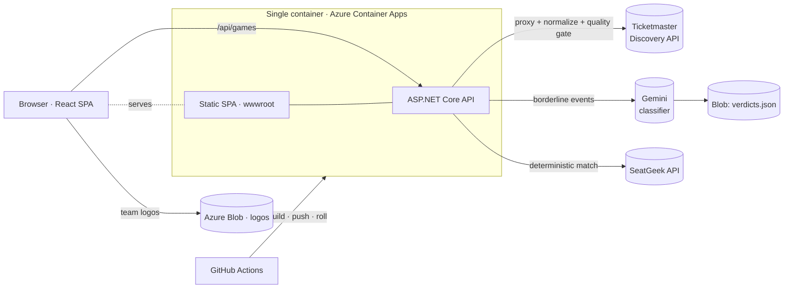

# Stadar

**Radar for future games.** Stadar answers one question: *"What live sports event should I go to, and how do I get there?"* — a discovery-first web app backed by live Ticketmaster data, an AI event-classification layer, and a venue-local trust layer that makes the times, teams, and leagues actually correct.

<p>
  <a href="https://stadar.politeflower-ad39c306.westus3.azurecontainerapps.io"></a>
  <a href="https://github.com/bnelson-mtb/stadar/actions/workflows/deploy.yml"></a>
  <a href="LICENSE"></a>
  
  
</p>

> 🔗 **Live:** https://stadar.politeflower-ad39c306.westus3.azurecontainerapps.io
> _(scales to zero — the first request after idle takes ~20s to wake; the client shows a "waking up the server" hint and retries automatically.)_

Stadar is a portfolio project by **Brady Nelson**, a CS student at the University of Utah. It's deliberately not a stats app or a betting app — purely **discovery + navigation** for upcoming live sports.

## Screenshots

<!--
  Drop PNGs into docs/screenshots/ and uncomment this block:

  | Discover | Event detail | Saved |
  |----------|--------------|-------|
  |  |  |  |
-->

> 📸 _Screenshots pending — in the meantime, the app is live: **[open the demo](https://stadar.politeflower-ad39c306.westus3.azurecontainerapps.io)**._

## Features

- **Discovery feed** — card-based browse of upcoming events for your state, backed by live Ticketmaster data.
- **Location** — manual state picker, IP auto-detect, persisted to `localStorage`.
- **Sport / league filters** — derived from the fetched events; normalized league + sport labels.
- **Favorites & "My Teams"** — heart a team, filter the feed to your teams (localStorage).
- **Saved events** — bookmark an event with a full snapshot, view it under a Saved tab and per-team pages, add notes and final scores.
- **Event detail** — full view with an embedded venue map, pricing, league info, and a direct **SeatGeek** link when a confident match exists (Google-search fallback otherwise).
- **Trust layer** — strict spectator-event filtering, league/sport normalization, and **venue-local** date/time so times match the arena, not your browser.
- **AI classification** — borderline events get a one-time [Gemini](https://ai.google.dev/) verdict (closed league/sport enums, structured output); verdicts are blob-cached and always win over the rules.

## Architecture

Single Docker container: the .NET API serves the built React SPA from `wwwroot`, so there's **one URL, no CORS**, and one thing to host.



**Request pipeline** (`GET /api/games`): proxy Ticketmaster → parse → normalize team names & league/sport → spectator-event quality gate → borderline rows get a cached Gemini verdict → sort by date → cache per-state for 5 minutes.

## Tech stack

| Layer | Choice |
|-------|--------|
| Frontend | React (Vite), React Router v7, Tailwind CSS v4 |
| Backend | ASP.NET Core Web API (.NET 10) |
| External data | Ticketmaster Discovery API v2, SeatGeek, Gemini (`gemini-2.5-flash-lite`) |
| Persistence | `localStorage` (client); Azure Blob for logos + classifier verdicts |
| Hosting | Single Docker container on Azure Container Apps (scale-to-zero) |
| CI/CD | GitHub Actions → ACR → Container App, OIDC login, images tagged by commit SHA |

## API

```text
GET /api/games?stateCode={XX}   # up to 50 upcoming events for a state (cached 5 min)
GET /api/games/{id}             # single event through the same pipeline (cached 5 min)
GET /api/games/{id}/seatgeek    # { "url": ... } direct SeatGeek link, or 404 (cached 6 h)
GET /healthz                    # liveness probe
```

> The path segment is `games`, not `events`, on purpose: ad-block filter lists (EasyPrivacy, AdGuard) match `/api/event` fragments and kill the fetch client-side.

## Run locally

```bash
# Terminal 1 — API  (http://localhost:5068)
cd Api
dotnet watch

# Terminal 2 — client  (http://localhost:5173)
cd client
npm install
npm run dev
```

The API needs a Ticketmaster key in `Api/appsettings.Development.json` (`Ticketmaster:ApiKey`). The Gemini and SeatGeek layers are optional — without their keys those features are simply inert.

```bash
# Run the API test suite
cd Api.Tests && dotnet test
```

## Deployment

Push to `main` and GitHub Actions runs the tests, builds the image on the runner, pushes to ACR, and rolls the Container App to the new commit-tagged image. Full hosting setup, one-time CI configuration, and cost breakdown live in **[docs/DEPLOYMENT.md](docs/DEPLOYMENT.md)**.

## Project docs

This repo keeps its design process in the open. Each feature was shipped spec → plan → implementation:

- **[docs/superpowers/specs/](docs/superpowers/specs/)** — design docs (trust layer, minor-league identification, LLM classification, SeatGeek links, …).
- **[docs/superpowers/plans/](docs/superpowers/plans/)** — the implementation plans those specs turned into.

## Roadmap

Web MVP (discovery, favorites, location, deploy, detail page, persistence) is **done**. Direction from here: validate on web → harden the API (custom domain, versioned contract) → React Native app (Expo) sharing the same API and data layer → Google Play, with push notifications ("your team plays tonight") as the mobile-native differentiator that finally justifies a database.

## License

[MIT](LICENSE) © Brady Nelson
