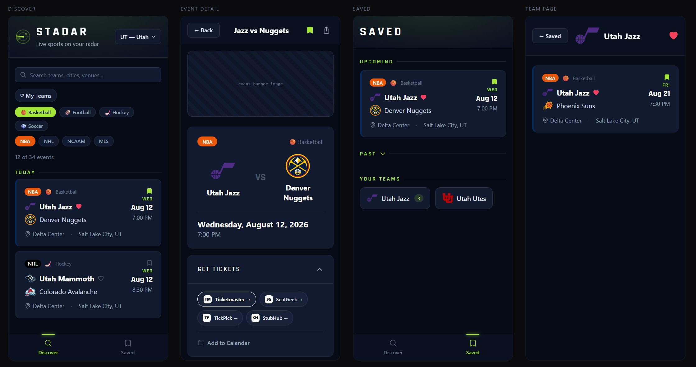
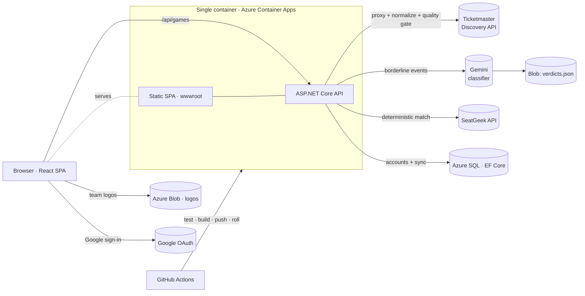

# Stadar

Stadar answers one question: *"What live sports event should I go to, and how do I get there?"*

A discovery-first web app backed by live Ticketmaster data, an AI event-classification layer, and a venue-local trust layer that makes the times, teams, and leagues accurate.

<p>
  <a href="https://stadar.politeflower-ad39c306.westus3.azurecontainerapps.io"></a>
  <a href="https://github.com/bnelson-mtb/stadar/actions/workflows/deploy.yml"></a>
  <a href="LICENSE"></a>
  
  
</p>

> 🔗 **Live:** [www.stadar.app](www.stadar.app)
> _(scales to zero - the first request after idle takes ~20s to wake)_

## Screenshots



## Features

- **Discovery feed** — card-based browse of upcoming events for your state, backed by live Ticketmaster data from the Discover API.
- **Location** — manual state picker, IP auto-detect, persisted to `localStorage`.
- **Sport / league filters** — derived from the fetched events; normalized league + sport labels.
- **Favorites & "My Teams"** — heart a team, filter the feed to your teams (localStorage).
- **Saved events** — bookmark an event with a full snapshot, view it under a Saved tab and per-team pages, add notes and final scores.
- **Accounts & cross-device sync** — Google sign-in; favorites and saved events sync to your account (Azure SQL via EF Core) and follow you across devices. First login offers a one-time import of anything saved locally. Anonymous browsing stays localStorage-only and never touches the database.
- **Event detail** — full view with an embedded venue map, pricing, league info, and direct links to SeatGeek and Ticketmaster when a confident match exists (Google-search fallback for non-matches and other ticketing platforms).
- **Trust layer** — strict spectator-event filtering, league/sport normalization, and **venue-local** date/time so times match the arena, not your browser.
- **AI classification** — borderline events get a one-time [Gemini](https://ai.google.dev/) verdict (closed league/sport enums, structured output); verdicts are blob-cached and always win over the rules.

## Architecture

Single Docker container: the .NET API serves the built React SPA from `wwwroot`, so there's **one URL, no CORS**, and one thing to host.


```mermaid
flowchart LR
    U[Browser · React SPA] -->|/api/games| API[ASP.NET Core API]
    subgraph container[Single container · Azure Container Apps]
        SPA[Static SPA · wwwroot] --- API
    end
    U -.serves.- SPA
    API -->|proxy + normalize + quality gate| TM[(Ticketmaster<br/>Discovery API)]
    API -->|borderline events| G[(Gemini<br/>classifier)]
    G --> V[(Blob: verdicts.json)]
    API -->|deterministic match| SG[(SeatGeek API)]
    U -->|team logos| B[(Azure Blob · logos)]
    U -->|Google sign-in| GO[(Google OAuth)]
    API -->|accounts + sync| SQL[(Azure SQL · EF Core)]
    CI[GitHub Actions] -->|test · build · push · roll| container
```

**Request pipeline** (`GET /api/games`): proxy Ticketmaster → parse → normalize team names & league/sport → spectator-event quality gate → borderline rows get a cached Gemini verdict → sort by date → cache per-state for 5 minutes.

**Account sync** (`/api/me/*`): signed-in users read and whole-set-replace their favorites and saved events; saved-event snapshots are stored per user, opaque to the server and keyed by event id. Anonymous requests never touch SQL.

## Tech stack

| Layer | Choice |
|-------|--------|
| Frontend | React (Vite), React Router v7, Tailwind CSS v4 |
| Backend | ASP.NET Core Web API (.NET 10) |
| External data | Ticketmaster Discovery API v2, SeatGeek, Gemini (`gemini-2.5-flash-lite`) |
| Auth | Google OAuth via ASP.NET Core built-in handlers |
| Persistence | `localStorage` (anonymous client); Azure SQL (EF Core) for account sync of favorites + saved events; Azure Blob for logos + classifier verdicts |
| Hosting | Single Docker container on Azure Container Apps (scale-to-zero) |
| CI/CD | GitHub Actions → ACR → Container App, OIDC login, images tagged by commit SHA |

## API

```text
GET  /api/games?stateCode={XX}   # up to 50 upcoming events for a state (cached 5 min)
GET  /api/games/{id}             # single event through the same pipeline (cached 5 min)
GET  /api/games/{id}/seatgeek    # { "url": ... } direct SeatGeek link, or 404 (cached 6 h)
GET  /api/me                     # current signed-in user, or 401
GET  /api/me/favorites           # account favorites      (PUT = whole-set replace)
GET  /api/me/saved               # account saved events   (PUT = whole-set replace)
GET  /api/auth/login             # start Google OAuth      (+ /callback, POST /logout)
GET  /healthz                    # liveness probe
```

## Run locally

```bash
# Terminal 1 — API  (http://localhost:5068)
cd Api
dotnet watch

# Terminal 2 — client  (http://localhost:5173)
cd client
npm install
npm run dev
```

The API needs a Ticketmaster key in `Api/appsettings.Development.json` (`Ticketmaster:ApiKey`). The Gemini, SeatGeek, and accounts layers are optional — without their config those features are simply inert. Accounts need both `Google:ClientId`/`Google:ClientSecret` and a `ConnectionStrings:Default` SQL connection string; with neither set, the app runs anonymous-only against `localStorage`.

```bash
# Run the API test suite
cd Api.Tests && dotnet test
```

## Roadmap

The Web MVP (discovery, favorites, location, deploy, detail page, persistence) is done. My direction from here is to validate on web, then continue iterating and making the app better, including a possible UI overhaul. Later in the roadmap is creating a React Native mobile app (Expo) sharing the same API and data layer, 

## License

[MIT](LICENSE) © Brady Nelson
